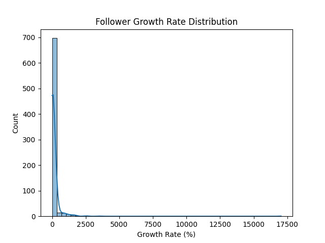
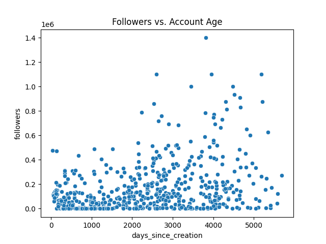
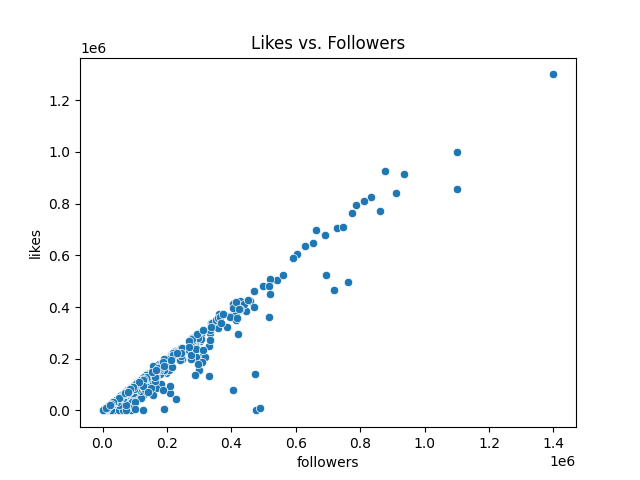
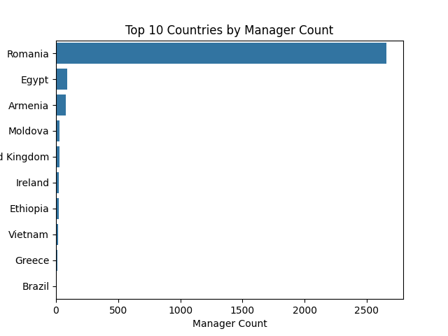
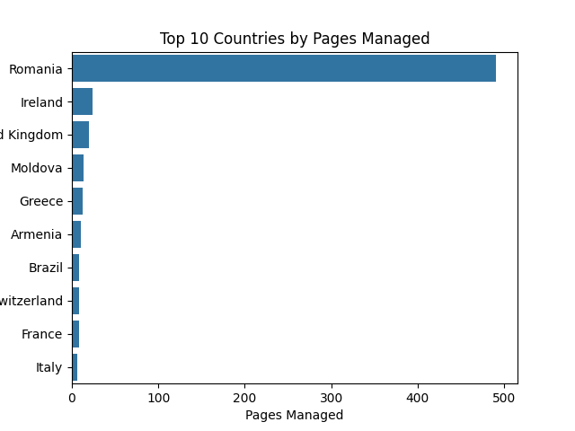

\n\n## 1. Follower Growth Rate Distribution\n\n\n\n\n\n## 2. Followers vs. Account Age\n\n\n\n\n\n## 3. Likes vs. Followers\n\n\n\n\n\n## 4. Frequent Name Changes\n\n| name                                                            |   name_changes |
|:----------------------------------------------------------------|---------------:|
| Destine de poveste                                              |              4 |
| Horse world                                                     |              4 |
| Suflet De Roman                                                 |              5 |
| Alături de Părintele Necula                                     |              5 |
| Amintiri Din Copilarie                                          |              6 |
| In your world                                                   |              6 |
| Îngerii ce ne privesc de sus, Credință și Rugăciuni             |              4 |
| Gheorghe Vasile-Georgian                                        |             12 |
| Neatza Romania                                                  |              5 |
| Stirile Fx Net                                                  |              7 |
| Călător prin România                                            |              6 |
| Tineretul Aliantei Liberalilor si Democratilor - TLDE Dambovita |              6 |
| Teodora                                                         |              4 |
| Bunica                                                          |              7 |
| Călător în România                                              |              8 |
| Romania Time                                                    |              4 |
| Alandala                                                        |             12 |
| E-neatza.ro                                                     |              5 |
| Acasa in Romania                                                |              5 |
| Alternativa Dreaptă Cluj                                        |              5 |
| Societatea românească                                           |              7 |
| România FM - Sănătate                                           |              5 |
| Viorel Iliescu                                                  |              5 |
| Karma•                                                          |             10 |
| Cai verzi                                                       |              4 |
| România Umanistă                                                |              4 |
| Îngeri printre stele •                                          |              8 |
| DRAGOSTEA MEA                                                   |              4 |
| România ta                                                      |              5 |
| 𝐉𝐮𝐫𝐧𝐚𝐥                                                          |              4 |
| Viața mea                                                       |              8 |
| Un gând bun                                                     |             13 |
| George Stancu•                                                  |              8 |
| Fabricat în România                                             |              5 |
| Familia                                                         |              7 |
| Regretele Unei Femei                                            |              4 |
| Acasă                                                           |              7 |
| România Ortodoxa                                                |              6 |
| Flori                                                           |              5 |
| Romania Noastra Retete-culinare.net                             |              5 |
| Stiriletv.ro                                                    |              4 |
| Viață                                                           |              5 |
| Călător prin țară                                               |              4 |
| Călător prin România                                            |              5 |
| Lumea noastră                                                   |              6 |
| România mea                                                     |              4 |
| Media Românească                                                |              8 |
| Suveranitate                                                    |              8 |
| Ardelenii                                                       |              4 |
| VIAȚĂ                                                           |              4 |
| Foaia patrioților                                               |              5 |
| Pufoşenia Zilei                                                 |              5 |\n\n## 5. High Manager Count Across Countries\n\n| name                                  |   manager_count |   unique_manager_countries |
|:--------------------------------------|----------------:|---------------------------:|
| Cake recipe                           |              23 |                          3 |
| Horse world                           |              22 |                          3 |
| MARED l PHOTOGRAPHY                   |              24 |                          4 |
| Horse world                           |              23 |                          3 |
| In your world                         |              23 |                          3 |
| Romani nebuni Râs                     |              16 |                          4 |
| CITATE CELEBRE                        |              16 |                          1 |
| Doctorul de Suflete                   |              16 |                          1 |
| Nimenideaici                          |              16 |                          1 |
| Verdict.Media                         |              22 |                          2 |
| Cancan.ro                             |              38 |                          2 |
| Vrei Sa Râzi ?                        |              18 |                          3 |
| Stiicumzic?                           |              16 |                          1 |
| Zâmbeşte                              |              17 |                          2 |
| Elevated                              |              19 |                          2 |
| MadLipz Romania                       |              21 |                          2 |
| Sfânta Fecioara Maria, Maica Domnului |              16 |                          3 |
| Părintele Arsenie Boca                |              16 |                          2 |
| Sfântul Efrem cel Nou                 |              16 |                          2 |
| Ortodoxia                             |              19 |                          2 |
| Sfantul Nectarie                      |              18 |                          2 |\n\n## 6. High Engagement but No Ads\n\n| name                                                |    followers | ad_status.has_run   |
|:----------------------------------------------------|-------------:|:--------------------|
| Destine de poveste                                  |  93000       | False               |
| România solidară                                    | 134000       | False               |
| Sanatate curata                                     | 197000       | False               |
| Romania noastra                                     | 153000       | False               |
| Roman diesel tatra kraz                             |  81000       | False               |
| Mașini Românești                                    | 146000       | False               |
| Suflet De Roman                                     |  99000       | False               |
| România Modernă                                     | 115000       | False               |
| Romania mea frumoasa                                | 310000       | False               |
| La mine acasa in Romania                            |  56000       | False               |
| Opinia Timisoarei                                   | 124000       | False               |
| Suflet Românesc                                     | 130000       | False               |
| Alături de Părintele Necula                         | 324000       | False               |
| România Eternă                                      | 116000       | False               |
| Lumea Camioanelor                                   | 318000       | False               |
| Autovehicule Românești                              | 518000       | False               |
| Buna, ce mai faci?                                  | 493000       | False               |
| Original Românesc                                   |  94000       | False               |
| Horse world                                         |  62000       | False               |
| Orasul Timisoara                                    | 338000       | False               |
| Obiceiuri Românești                                 | 214000       | False               |
| Amintiri Din Copilarie                              | 233000       | False               |
| Generația de Aur Conectată                          | 290000       | False               |
| In your world                                       |  57000       | False               |
| Viața nu-i perfectă                                 |  79000       | False               |
| Rugăciune către Dumnezeu, Refugiul Inimii Tale      | 130000       | False               |
| Diana Iovanovici Șoșoacă- Oficial                   | 491000       | False               |
| Un român prin Țări Străine                          | 107000       | False               |
| Îngerii ce ne privesc de sus, Credință și Rugăciuni | 189000       | False               |
| Timpul rezolva tot                                  | 141000       | False               |
| Una ai                                              | 126000       | False               |
| Și eu sunt prin Țări Străine                        |  79000       | False               |
| Partidul S.O.S România                              |  59000       | False               |
| Timpul rezolva tot                                  | 260000       | False               |
| Gândire prăfuită                                    | 332000       | False               |
| Gândire prăfuită                                    | 282000       | False               |
| Diana Iovanovici-Șoșoacă                            | 273000       | False               |
| Departe de Casă                                     | 188000       | False               |
| Gheorghe Vasile-Georgian                            | 263000       | False               |
| Fericire Si Speranță Ingerii Inimii Tale            | 170000       | False               |
| La vremea lor                                       |  81000       | False               |
| Gheorghe Vasile-Georgian                            |  73000       | False               |
| Lacrimi si Necazuri                                 | 285000       | False               |
| MAMA                                                | 163000       | False               |
| Cunoaste tot                                        |  59000       | False               |
| PtSuflet                                            | 138000       | False               |
| Fhaye Mous Hugot                                    |  64000       | False               |
| Romani nebuni Râs                                   |  62000       | False               |
| Euro-Media                                          | 273000       | False               |
| Smimahtest                                          |  88000       | False               |
| Rugaciune din suflet                                |  80000       | False               |
| News Badger                                         |  70000       | False               |
| Neatza Romania                                      | 169000       | False               |
| News Badger                                         | 212000       | False               |
| Bancuri noi                                         | 405000       | False               |
| Vedete România                                      |  69000       | False               |
| Timiș Info                                          |  84000       | False               |
| Totul pentru Tine                                   | 246000       | False               |
| Avram Florea                                        | 161000       | False               |
| Povestea Mea                                        | 309000       | False               |
| Stirile Fx Net                                      | 142000       | False               |
| Călător prin România                                | 543000       | False               |
| Iubesc Romania                                      | 119000       | False               |
| Suflet Călător                                      | 127000       | False               |
| Mesaje de suflet                                    |  79000       | False               |
| Stiri Romania                                       | 210000       | False               |
| Romania Plus                                        | 153000       | False               |
| Babuta cea Amuzanta                                 | 360000       | False               |
| Broscuta Vesela                                     | 298000       | False               |
| Bancuri cu bula                                     | 224000       | False               |
| Romania9                                            | 516000       | False               |
| Smeily                                              | 694000       | False               |
| Inima României                                      | 101000       | False               |
| Romania Live                                        | 140000       | False               |
| Funny4All                                           | 112000       | False               |
| Parintele Arsenie Boca                              | 430000       | False               |
| România Creștină                                    | 108000       | False               |
| Uită-mă.                                            | 178000       | False               |
| Seful Bula                                          | 304000       | False               |
| Health Badger                                       |  85000       | False               |
| Noi Iubim Romania                                   | 144000       | False               |
| Romania in Imagini                                  | 374000       | False               |
| JustfunRo                                           | 126000       | False               |
| Lacrimi Pentru Mama                                 | 332000       | False               |
| Iubesc Animalele                                    | 652000       | False               |
| CITATE CELEBRE                                      | 832000       | False               |
| Reverie                                             | 937000       | False               |
| Bontas Marian  (Bontas Marian)                      |  99000       | False               |
| Georgel Avram                                       | 135000       | False               |
| Pisicuta Vesela                                     | 209000       | False               |
| Din Suflet                                          | 306000       | False               |
| Mormântul Părintelui Arsenie Boca                   | 220000       | False               |
| Mândria României                                    | 118000       | False               |
| Romania Mare                                        | 106000       | False               |
| Țicniți                                             | 397000       | False               |
| Impresionant                                        | 350000       | False               |
| Traditional Romanesc                                | 154000       | False               |
| Reactii Nebune                                      |  70000       | False               |
| Cosmin Avram                                        | 875000       | False               |
| Doctorul de Suflete                                 | 499000       | False               |
| Împreuna promovăm România                           | 284000       | False               |
| Un Desert Dulce                                     |  85000       | False               |
| Azur                                                | 247000       | False               |
| Nimenideaici                                        | 236000       | False               |
| Verdict.Media                                       | 171000       | False               |
| Poze pentru gravidute si bebei                      | 335000       | False               |
| nuepanica.net                                       | 663000       | False               |
| Cioburi de Suflet                                   | 136000       | False               |
| România Frumoasă                                    | 414000       | False               |
| Citate Faimoase                                     | 200000       | False               |
| Promovăm Romania                                    | 446000       | False               |
| Misterele Istoriei                                  | 213000       | False               |
| Românesc                                            | 216000       | False               |
| Dr. Monica Popa                                     | 434000       | False               |
| Glume de la A la Z                                  | 116000       | False               |
| Învățături de bine                                  |  55000       | False               |
| Româncuța                                           | 123000       | False               |
| Romania Today                                       |  71000       | False               |
| Vrei Sa Râzi ?                                      | 126000       | False               |
| Telepress                                           | 477000       | False               |
| Stiicumzic?                                         | 486000       | False               |
| Bunătatea Sufletului                                | 228000       | False               |
| Viata si culori                                     | 175000       | False               |
| Teodora                                             | 911000       | False               |
| Bine de stiut                                       | 124000       | False               |
| Rețete Românești                                    |  65000       | False               |
| Priveste si Asculta                                 |      1e+06   | False               |
| Prislop                                             | 165000       | False               |
| Gigi Becali Comunitate                              |  90000       | False               |
| ** IuBirEa InVinGe tOt **                           | 603000       | False               |
| Bunica                                              | 134000       | False               |
| Poteci de Dor                                       | 335000       | False               |
| Pasi prin viata                                     | 185000       | False               |
| Mesaje din Suflet                                   |  87000       | False               |
| Life Story                                          | 183000       | False               |
| Călător în România                                  | 247000       | False               |
| Alandala jr                                         | 422000       | False               |
| Mândru că trăiesc în România                        | 260000       | False               |
| Caterinca La Maxim                                  | 161000       | False               |
| MARIA                                               | 315000       | False               |
| Romania Time                                        | 224000       | False               |
| Flori de dor                                        | 459000       | False               |
| Nimic fără Iubire                                   | 120000       | False               |
| Alandala                                            | 470000       | False               |
| Alandala                                            | 519000       | False               |
| Citește                                             | 472000       | False               |
| Bancuri & Glume                                     | 205000       | False               |
| România Bogată                                      | 131000       | False               |
| E-neatza.ro                                         | 155000       | False               |
| Acasa in Romania                                    | 684000       | False               |
| Meleagurile României                                | 267000       | False               |
| Bucătăria e plăcerea mea                            |  58000       | False               |
| Frumuseti Romanesti                                 | 129000       | False               |
| Ziarul Digital                                      |  51000       | False               |
| Manastirea Bârsana                                  | 115000       | False               |
| Bucataria Traditionala                              | 112000       | False               |
| Frumusețile României                                |  90000       | False               |
| Noaptea Minții                                      |  56000       | False               |
| Plaiul natal                                        |  93000       | False               |
| România FM - Timișoara                              | 122000       | False               |
| Traditii Romanesti                                  |  58000       | False               |
| Societatea românească                               | 202000       | False               |
| Apreciază                                           |  70000       | False               |
| România                                             | 131000       | False               |
| Un strop de iubire                                  |  90000       | False               |
| No, du-te în bâta                                   | 131000       | False               |
| România, țara mea frumoasă                          | 490000       | False               |
| Zâna bună                                           | 240000       | False               |
| România FM - Sport                                  | 122000       | False               |
| Secretele vieții                                    | 131000       | False               |
| România FM                                          | 788000       | False               |
| România FM - Sănătate                               | 141000       | False               |
| Viorel Iliescu                                      | 302000       | False               |
| Delicios                                            | 124000       | False               |
| România Minunată                                    | 278000       | False               |
| Trairi si sentimente                                |  72000       | False               |
| Bezna Minții                                        |  93000       | False               |
| Rânduri din viața                                   | 335000       | False               |
| Karma•                                              | 108000       | False               |
| Satele din România                                  | 518000       | False               |
| Indemnul inimii                                     | 178000       | False               |
| Pentru Suflet                                       | 135000       | False               |
| România                                             | 297000       | False               |
| Cai verzi                                           | 127000       | False               |
| Iubire maximă                                       |  79000       | False               |
| Lumina Credintei                                    | 244000       | False               |
| Doar tu                                             |  95000       | False               |
| Curiozități Globale                                 |  73000       | False               |
| Muzica Eurodance                                    | 719000       | False               |
| Paradisul florilor                                  | 193000       | False               |
| Despre viata                                        |  98000       | False               |
| România mea frumoasă                                | 156000       | False               |
| Îngeri printre stele •                              |  69000       | False               |
| Uimește-ți Mintea                                   | 191000       | False               |
| News Romania                                        |  76000       | False               |
| Inima de mama                                       |  66000       | False               |
| Stiri                                               |  57000       | False               |
| Amintire de iubire                                  |  90000       | False               |
| Fabrica de Uimiri                                   |  89000       | False               |
| România in Strainatate                              |  94000       | False               |
| Iubirea rezolva totul                               |  56000       | False               |
| Lacrimile  Cerului                                  | 137000       | False               |
| DRAGOSTEA MEA                                       | 427000       | False               |
| Cinematografia Veche                                | 762000       | False               |
| România ta                                          | 350000       | False               |
| Zâmbeşte                                            | 166000       | False               |
| Pentru Tine                                         | 415000       | False               |
| Filme Vechi                                         | 405000       | False               |
| Natura cu frumusetile ei                            | 470000       | False               |
| România ta                                          | 363000       | False               |
| Trandafirul Prieteniei                              | 692000       | False               |
| Leacurile unei Femei                                | 305000       | False               |
| Sentris                                             |  92000       | False               |
| Terapie prin zămbet                                 | 287000       | False               |
| România ta                                          |  71000       | False               |
| 𝐉𝐮𝐫𝐧𝐚𝐥                                              | 210000       | False               |
| Observatorul                                        |  76000       | False               |
| Graviduțe și bebei                                  |  82000       | False               |
| Pagina iubitorilor de Dumnezeu-Tu, il iubesti?      |  94000       | False               |
| Să râdem  împreuna                                  |  53000       | False               |
| Observatorul                                        | 118000       | False               |
| Familia Becali                                      | 112000       | False               |
| Amintiri frumoase                                   |      1.4e+06 | False               |
| Terapie prin zâmbet                                 | 128000       | False               |
| Elevated                                            | 163000       | False               |
| Un suflet                                           | 560000       | False               |
| Dreamer                                             | 131000       | False               |
| Te ıubesc                                           |  98000       | False               |
| Iisus , tine la tine .                              | 773000       | False               |
| Umor Bun                                            | 521000       | False               |
| Românii din Străinătate                             | 123000       | False               |
| 𝙼𝙾𝙾𝙳                                                | 286000       | False               |
| Ingerii Inimii TALE                                 | 291000       | False               |
| Regretele Unei Femei                                | 339000       | False               |
| Some loves                                          | 103000       | False               |
| Amintiri frumoase                                   | 439000       | False               |
| Flori Frumoase                                      | 277000       | False               |
| România ta                                          | 105000       | False               |
| Tristetea Sufletului                                |  71000       | False               |
| Viața mea                                           | 227000       | False               |
| Exploratorul Mintii                                 | 139000       | False               |
| Infinit de cuvinte                                  |  68000       | False               |
| Unofficial: Andra Măruță                            | 404000       | False               |
| Petale De Singurătate                               | 159000       | False               |
| Trandafirul albastru                                | 107000       | False               |
| Dulce Romanie                                       | 395000       | False               |
| Bucuria de-a trăi                                   |  53000       | False               |
| Remedii Naturiste                                   |  51000       | False               |
| Aripi de iubire                                     | 453000       | False               |
| Sunt frumoasă așa cum sunt                          |  71000       | False               |
| Razi cu noi                                         | 353000       | False               |
| MadLipz Romania                                     | 296000       | False               |
| Un gând bun                                         |  64000       | False               |
| Statusuriiiiiiiii - aici                            | 272000       | False               |
| Departe-s de casă                                   | 163000       | False               |
| Umorul                                              | 295000       | False               |
| Glume interesante                                   | 195000       | False               |
| Dumnezeu e bun                                      |  64000       | False               |
| Acasă                                               | 275000       | False               |
| George Becali                                       | 144000       | False               |
| O mama si un suflet                                 |  88000       | False               |
| Mesaje Frumoase                                     | 276000       | False               |
| George Stancu•                                      | 243000       | False               |
| DRAGOSTEA MEA                                       | 729000       | False               |
| Curiozitatile momentului                            |  74000       | False               |
| Sufletel                                            | 179000       | False               |
| Observatorul                                        | 105000       | False               |
| Nea Mărin fanpage                                   | 278000       | False               |
| Iubire                                              |  97000       | False               |
| Noi doi                                             | 746000       | False               |
| PtSuflet                                            | 363000       | False               |
| Românii din Străinătate                             | 206000       | False               |
| Ora De Ras                                          | 204000       | False               |
| Mesagerul Sufletului                                | 100000       | False               |
| Vasian                                              |  80000       | False               |
| Fabricat în România                                 | 357000       | False               |
| Familia                                             | 505000       | False               |
| Doza ta de Ras                                      | 192000       | False               |
| Sebastian Boruz                                     | 541000       | False               |
| Treziri                                             | 245000       | False               |
| Singur Acasa 1,2,3,4                                |  86000       | False               |
| Regretele Unei Femei                                | 428000       | False               |
| Versuri Rap                                         | 124000       | False               |
| Acasă                                               |      1.1e+06 | False               |
| Bancuri BETON                                       | 333000       | False               |
| România ta                                          | 192000       | False               |
| Iubim Stirile                                       |  88000       | False               |
| Iubirea învinge •                                   | 100000       | False               |
| Sarbatori Romanesti                                 | 178000       | False               |
| De toate                                            | 341000       | False               |
| Felicitari animate si muzicale                      | 155000       | False               |
| Sfânta Fecioara Maria, Maica Domnului               | 415000       | False               |
| Cartea-sufletului si a oamenilor de buna credinta.  | 419000       | False               |
| România, țara lui Dumnezeu                          | 277000       | False               |
| Le secret du bonheur                                |  89000       | False               |
| România pământ Sfânt                                | 289000       | False               |
| Lumea lui Ruxy                                      | 201000       | False               |
| România Ortodoxa                                    | 878000       | False               |
| Flori                                               |  52000       | False               |
| Romania Noastra Retete-culinare.net                 | 171000       | False               |
| Secretele bunicii                                   |  94000       | False               |
| Flori Si Peisaje                                    | 220000       | False               |
| Părintele Arsenie Boca                              | 590000       | False               |
| Sfinții Arhangheli Mihail și Gavril                 |  68000       | False               |
| Votre divertissement                                | 128000       | False               |
| Români din toată lumea                              | 291000       | False               |
| Monde Intéressant                                   | 103000       | False               |
| Povești din inimă                                   |  85000       | False               |
| Regretele unei femei                                | 385000       | False               |
| Dor de Romania                                      | 177000       | False               |
| Lumea lui Mary                                      | 364000       | False               |
| Românașul                                           |  64000       | False               |
| Drôle de monde                                      | 102000       | False               |
| Zodii Romania                                       | 628000       | False               |
| ATHOS                                               | 189000       | False               |
| Sfântul Efrem cel Nou                               | 125000       | False               |
| La mine acasa in Romania.                           | 551000       | False               |
| Monde des idées                                     |  99000       | False               |
| Iubitorii părintelui Calistrat                      | 157000       | False               |
| România, țară binecuvântată                         | 294000       | False               |
| Rions un peu                                        | 176000       | False               |
| Ortodoxia                                           | 336000       | False               |
| România Civică TV - ROC TV                          |  73000       | False               |
| Meilleure distraction                               |  51000       | False               |
| Faze Tari                                           |  96000       | False               |
| România                                             | 436000       | False               |
| Sanatatea.ro                                        | 218000       | False               |
| Iisus Hristos, Mântuitorul lumii                    | 105000       | False               |
| Stiriletv.ro                                        | 313000       | False               |
| Viață                                               | 111000       | False               |
| Romania e viata mea                                 | 267000       | False               |
| Viața în România                                    | 312000       | False               |
| Jocuri10                                            | 173000       | False               |
| Învierea Domnului nostru Iisus Hristos              |  69000       | False               |
| Sarbatori alaturi de tine                           | 785000       | False               |
| Monde des animaux                                   |  62000       | False               |
| România                                             | 101000       | False               |
| Sfantul Nectarie                                    | 813000       | False               |
| Sfânta Cuvioasa Parascheva                          | 189000       | False               |
| Iarba verde de acasă                                |  71000       | False               |
| Poate nu stiai                                      | 166000       | False               |
| Manastirea Sufletului                               | 331000       | False               |
| Fii Superba                                         | 374000       | False               |
| Bonne info                                          |  78000       | False               |
| MARIA                                               | 230000       | False               |
| Călător prin țară                                   |  98000       | False               |
| Călător prin România                                | 126000       | False               |
| Lumea noastră                                       | 140000       | False               |
| Te seaca iubirea                                    | 217000       | False               |
| Ministerul Afacerilor Interne, Romania              |      1e+06   | False               |
| Din România                                         | 269000       | False               |
| România mea                                         | 152000       | False               |
| DIVIN                                               | 113000       | False               |
| Jandarmeria Română                                  | 254000       | False               |
| Stiri Online                                        |  66000       | False               |
| Casa de la țară                                     |  53000       | False               |
| Ardelenii                                           | 423000       | False               |
| Observatoru'                                        |  52000       | False               |
| VIAȚĂ                                               |  94000       | False               |
| DUMNEZEU Există                                     | 141000       | False               |
| Românașul                                           |  86000       | False               |
| Iubesc Natura                                       | 191000       | False               |
| URĂRI                                               |  70000       | False               |
| Românașul                                           | 213000       | False               |
| Poliția Română                                      |      1.1e+06 | False               |
| ISU Timiș                                           |  64000       | False               |
| ȘTIRI                                               |  80000       | False               |
| DOZA De RAS                                         | 367000       | False               |\n\n## 7. Page Managers by Country\n\n\n\n\n\n## 8. Pages per Manager Country\n\n\n\n\n\n## 9. Pages with Scraping Errors (Likes Missing)\n\n| name                                                            |    followers |
|:----------------------------------------------------------------|-------------:|
| Destine de poveste                                              |  93000       |
| Horse world                                                     |  27000       |
| Alături de Părintele Necula                                     | 324000       |
| Buna, ce mai faci?                                              | 493000       |
| Amintiri Din Copilarie                                          | 233000       |
| Viața nu-i perfectă                                             |  79000       |
| Diana Iovanovici Șoșoacă- Oficial                               | 491000       |
| Un român prin Țări Străine                                      | 107000       |
| Mihai-Dan KISS                                                  |   3400       |
| Cabinet Europarlamentar - Diana Iovanovici-Șoșoacă              |  38000       |
| Gândire prăfuită                                                | 282000       |
| Diana Iovanovici-Șoșoacă                                        | 273000       |
| Gheorghe Vasile-Georgian                                        | 263000       |
| Gheorghe Vasile-Georgian                                        |  73000       |
| Fhaye Mous Hugot                                                |  64000       |
| Neatza Romania                                                  | 169000       |
| ALDE - Pucioasa                                                 |    851       |
| ALDE - Moreni                                                   |    739       |
| Stirile Fx Net                                                  | 142000       |
| Radio Fx Net                                                    | 266000       |
| Suflet de floare                                                |  24000       |
| Mesaje de suflet                                                |  79000       |
| ALDE - Găeşti                                                   |    729       |
| Babuta cea Amuzanta                                             | 360000       |
| Romania9                                                        | 516000       |
| Te Venussien                                                    |  48000       |
| Funny4All                                                       | 112000       |
| Tineretul Aliantei Liberalilor si Democratilor - TLDE Dambovita |    985       |
| Lacrimi Pentru Mama                                             | 332000       |
| Bontas Marian  (Bontas Marian)                                  |  99000       |
| Las Fierbinti FanClub                                           |  28000       |
| Impresionant                                                    | 350000       |
| ALDE - Titu                                                     |    651       |
| Cosmin Avram                                                    | 875000       |
| Verdict.Media                                                   | 171000       |
| Poze pentru gravidute si bebei                                  | 335000       |
| Cioburi de Suflet                                               | 136000       |
| Misterele Istoriei                                              | 213000       |
| ALDE - Fieni                                                    |    794       |
| Stiicumzic?                                                     | 486000       |
| Alianța pentru Suveranitate Covasna                             |   3400       |
| Alternativa Dreapta Gorj                                        |    691       |
| Gabriel Dimofte                                                 |   8299       |
| Alternativa Dreapta - Organizația locală  Floreşti              |    580       |
| Catalin Tataru                                                  |    nan       |
| Priveste si Asculta                                             |      1e+06   |
| Arges - Partidul Neamul Romanesc                                |   5700       |
| Galati - Partidul Neamul Romanesc                               |  15000       |
| Pasi prin viata                                                 | 185000       |
| Mesaje din Suflet                                               |  87000       |
| Trairi si Sclipiri                                              |  18000       |
| Satu Mare - Partidul Neamul Romanesc                            |   2900       |
| Mândru că trăiesc în România                                    | 260000       |
| Caterinca La Maxim                                              | 161000       |
| MARIA                                                           | 315000       |
| Partidul Neamul Romanesc filiala Gorj                           |   5000       |
| Din dragoste pentru tine                                        |  14000       |
| Hunedoara - Partidul Neamul Romanesc                            |   4700       |
| Alternativa Dreaptă Timiș                                       |    704       |
| Alianța pentru Suveranitate Tulcea                              |    161       |
| Acasa in Romania                                                | 684000       |
| Frumuseti Romanesti                                             | 129000       |
| Alternativa Dreaptă Cluj                                        |   3000       |
| Alianța pentru Suveranitate Harghita                            |    108       |
| Alianța pentru Suveranitate Vrancea                             |    156       |
| Alternativa Dreaptă Sibiu                                       |    895       |
| Noaptea Minții                                                  |  56000       |
| Alianța pentru Suveranitate Buzău                               |    600       |
| Un strop de iubire                                              |  90000       |
| Salaj - Partidul Neamul Romanesc                                |   7800       |
| România FM - Sport                                              | 122000       |
| Secretele vieții                                                | 131000       |
| Partidul Alternativa Dreaptă Maramureș                          |    696       |
| Alternativa Dreaptă - Organizatia Diaspora                      |   1000       |
| România Minunată                                                | 278000       |
| Alianța pentru Suveranitate Vaslui                              |    496       |
| Alianța pentru Suveranitate Bistrița-Năsăud                     |    944       |
| Pentru Suflet                                                   | 135000       |
| Organizaţia Judeţeană Suceava a Partidului Neamul Românesc      |   3500       |
| Români cu Onoare, Respect, Demnitate și Curaj                   |   2000       |
| Despre viata                                                    |  98000       |
| Ulise Toader                                                    |   4400       |
| Inima de mama                                                   |  66000       |
| Graviduțe și bebei                                              |  82000       |
| Familia Becali                                                  | 112000       |
| Dreamer                                                         | 131000       |
| Some loves                                                      | 103000       |
| Tristetea Sufletului                                            |  71000       |
| Bucuria de-a trăi                                               |  53000       |
| Un gând bun                                                     |  64000       |
| George Becali                                                   | 144000       |
| George Stancu•                                                  | 243000       |
| Vasian                                                          |  80000       |
| Familia                                                         | 505000       |
| Sebastian Boruz                                                 | 541000       |
| Singur Acasa 1,2,3,4                                            |  86000       |
| De toate                                                        | 341000       |
| Alternativa Dreapta Timisesti                                   |    672       |
| Aur Sîntamaria-orlea                                            |   1700       |
| Lumea lui Ruxy                                                  | 201000       |
| Mihai-Cosmin Pascariu                                           |   6600       |
| Romania Noastra Retete-culinare.net                             | 171000       |
| Badea Elena                                                     |    nan       |
| Alternativa Dreaptă Botoşani                                    |    759       |
| Stiai ca?                                                       |  45000       |
| Alternativa Dreaptă Suceava                                     |    690       |
| Alternativa Dreaptă Vaslui                                      |    591       |
| Alternativa Dreaptă - Spania                                    |    782       |
| Alternativa Dreapta Galati                                      |   1400       |
| Adina Iriza                                                     |    nan       |
| UFP - Uniunea Forțelor Patriotice                               |    566       |
| Susținem Diana Iovanovici-Șoșoacă Președinte                    |   3900       |
| La mine acasa in Romania.                                       | 551000       |
| Alternativa Dreapta Vrancea                                     |    518       |
| Adrian Mircea                                                   |    986       |
| România                                                         | 436000       |
| Viață                                                           | 111000       |
| Aur Arad                                                        |   1357       |
| Sarbatori alaturi de tine                                       | 785000       |
| Alternativa Dreaptă Organizația Valea Lupului                   |    473       |
| Mariana Lenuta Suci                                             |    nan       |
| Poveștiri din Darabani                                          |    561       |
| Alternativa Dreapta Neamt                                       |    676       |
| Ioan Crismariu                                                  |   3800       |
| Alternativa Dreaptă Târgu Neamț                                 |    555       |
| Daniel Cociorva                                                 |   6200       |
| Aur Arad                                                        |   1357       |
| Partidul DAC Călărași                                           |   1700       |
| ISU Mehedinţi                                                   |  10000       |
| ISU Cluj                                                        |  24000       |
| Partidul Libertății Olt                                         |    971       |
| Lumea noastră                                                   | 140000       |
| Partidul Libertății Ialomița                                    |    851       |
| Partidul Libertății Harghita                                    |   1200       |
| Partidul DAC Covasna                                            |    738       |
| ISU „Bucovina" Suceava                                          |  37000       |
| DACII Județul Caraș-Severin                                     |    938       |
| Ministerul Afacerilor Interne, Romania                          |      1e+06   |
| DACII Județul Teleorman                                         |    725       |
| Partidul DAC Brăila                                             |    539       |
| DACII Județul Buzău                                             |    958       |
| DACII Județul Vrancea                                           |    805       |
| Patrioții                                                       |   2100       |
| Libertate pentru România                                        |     11       |
| DACII Județul Călărași                                          |    736       |
| Partidul Libertății Ilfov                                       |    897       |
| Gazeta Patriei                                                  |    166       |
| Partidul DAC Buzău                                              |    737       |
| Țărănistul                                                      |    499       |
| Partidul DAC Mureș                                              |    606       |
| ISU Maramures                                                   |  16000       |
| Jandarmeria Română                                              | 254000       |
| ISU Hunedoara                                                   |  24000       |
| Media Românească                                                |   3000       |
| PNȚ - Partidul Național Țărănesc                                |   2300       |
| Partidul DAC Brașov                                             |   2100       |
| Direcția Generală Anticorupție                                  |  43000       |
| Partidul Libertății Covasna                                     |   1300       |
| Suveranitate                                                    |   3800       |
| Partidul DAC Iași                                               |    559       |
| Partidul DAC Ilfov                                              |    921       |
| DACII                                                           |   2700       |
| Partidul DAC Sibiu                                              |    816       |
| DACII Județul Suceava                                           |   1000       |
| Mișcarea România Suverană                                       |   1000       |
| Nimeni nu știe durerea mea                                      |  20000       |
| Observatoru'                                                    |  52000       |
| Partidul Național Român                                         |   1900       |
| ȘTIRI Plus                                                      |  15000       |
| Partidul DAC Dolj                                               |    728       |
| ISU Covasna                                                     |  10000       |
| DACII Județul Vaslui                                            |   1000       |
| Noi Țărăniștii                                                  |    360       |
| Partidul Libertății Dolj                                        |    875       |
| ISU Alba                                                        |  15000       |
| Partidul Libertății Iași                                        |   1200       |
| DACII Județul Arad                                              |   1200       |
| ISU Harghita                                                    |  11000       |
| Partidul DAC Sălaj                                              |    762       |
| Partidul Libertății Constanța                                   |   1300       |
| Poliția Română                                                  |      1.1e+06 |
| Partidul DAC Ialomița                                           |    829       |
| Țărăniștii                                                      |   1600       |
| DACII Județul Brăila                                            |   1200       |
| Partidul DAC Vâlcea                                             |    852       |
| Dan Aslan                                                       |    nan       |
| ISU Timiș                                                       |  64000       |
| Partidul DAC Vrancea                                            |    889       |
| ISU Salaj                                                       |  12000       |
| Partidul DAC Vaslui                                             |   1000       |
| Partidul Țărănesc                                               |    289       |
| Partidul Libertății Brașov                                      |   1200       |
| Grupul cu Bancuri                                               |  15000       |\n\n## 10. Page Type Trends\n\n| account_type   |   count |     mean |   median |
|:---------------|--------:|---------:|---------:|
| Page           |     731 | 130941   |    57000 |
| Profile        |       6 |  48714.3 |     5000 |